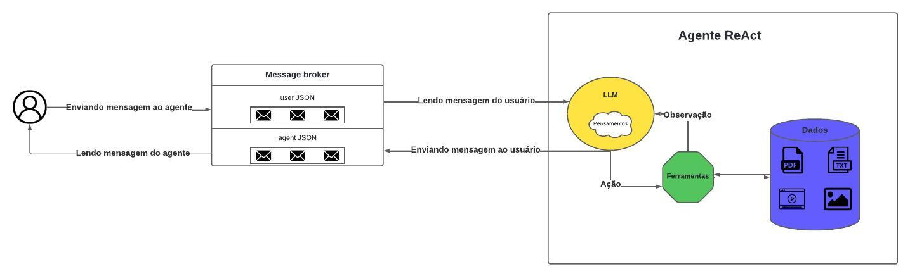
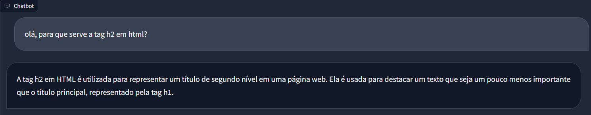

# Solução desenvolvida

## Arquitetura da solução

No diagrama abaixo, é possível visualizar a arquitetura da solução desenvolvida. <br>



A seguir, irei explicar cada um dos componentes da solução e como eles foram desenvolvidos.

Primeiramente, a solução foi dividida em duas partes: a indexação dos dados e o prompt de aprendizagem adaptativa.

### Indexação dos dados

Em relação à indexação dos dados, cada tipo de dado foi processado da seguinte forma:

- **Vídeo**: o vídeo foi transcrito utilizando o Whisper da OpenAI, o conteúdo da transcrição foi salvo em um txt e eu fiz o upload do vídeo no YouTube como não listado, para que eu pudesse manipular o link e pedir para o LLM enviar ao usuário. Nesse sentido, na transcrição, foram extraídos os timestamps de cada fala e, com essa informação, foi possível criar links de vídeos personalizados para cada fala do vídeo. Ao fim, tudo isso foi indexado: transcrição das falas, com seus timestamps e o link do vídeo no YouTube, já adaptado no tempo da fala.
- **Imagem**: a imagem teve seu conteúdo extraído utilizando o GPT-4o e salvo em um arquivo txt. As informações do txt foram indexadas, em um índice separado para a imagem. Além disso, na recuperação das informações do index o link da imagem é passado para o LLM, para que ele possa oferecer isso em sua resposta.
- **PDF**: o PDF foi processado através do leitor automático do LlamaIndex, que extrai o conteúdo do PDF de acordo com o tamanho de chunk escolhido. O conteúdo extraído foi indexado em um índice separado para o PDF.
- **Exercícios JSON**: os exercícios sobre PHP, oferecidos no JSON, foram organizados e colocados em um arquivo txt, que foi indexado em um índice separado para os exercícios.

A partir disso, foi possível tornar esses dados acessíveis para o LLM (agente) através dos índices criados. Ressalta-se também que a recuperação de dados foi configurada para retornar dados que tenham mais de 75% de similaridade com a requisição. Assim, o componente 'Dados' da arquitetura foi desenvolvido.

### Prompt de aprendizagem adaptativa

Inicialmente, percebi que o desafio proposto exigia um comportamento amplo do LLM e, por isso, seria difícil criar uma solução que abrangesse todos os tipos de interações possíveis do usuário. Desse modo, optei pela criação de um agente ReAct.

Um agente ReAct (Reason Act) é um agente (LLM) que, a partir de uma interação com o usuário, pensa sobre o que ele irá fazer (Reason) e tomada a decisão, age (Act) e, como resultado da ação, recebe uma observação (Observation). Além disso, é possível fornecer ferramentas para esse agente, que são funções Python que o LLM pode chamar para tomar uma ação.

Nesse sentido, o agente ReAct foi desenvolvido para o desafio, para que o dialógo com o usuário fosse algo fluido e não rígido.

Em seu prompt, o agente recebeu as seguintes instruções:

- Não responder perguntas que não sejam sobre HTML;
- Captar o nível de dificuldade do usuário a partir da forma como ele faz a pergunta;
- Detectar se o usuário está pedindo um vídeo, um texto ou um exercício;
- Utilizar as ferramentas disponíveis para responder ao usuário.

E as ferramentas oferecidas foram:

- **send_message**: envia uma mensagem ao usuário;
- **get_content**: recupera o conteúdo de um índice específico, com base no formato de preferência do usuário;
- **get_php_exercises**: recupera um exercício de PHP do índice de exercícios;

Desse modo, o componente 'Agente ReAct' da arquitetura foi desenvolvido.

### Message broker

Há também, um terceiro componente envolvido na solução, que é o Message Broker. Este componente é responsável por intermediar a comunicação entre o usuário e o agente ReAct, de modo que ele recebe as mensagens do usuário, salva em um JSON que será consumido pelo agente ReAct, recebe a resposta do agente e salva em um JSON que será consumido pelo usuário.


### Exemplos de interações

Na primeira interação, perguntei para que serve a tag h2 em HTML.



Por trás da resposta, este foi o raciocínio do agente ReAct:


Após isso, pedi para me explicar de forma mais avançada.


E o raciocínio do agente ReAct foi:


Por fim, pedi para me enviar um vídeo sobre a tag h2.


E o raciocínio do agente ReAct foi:


Ao clicar no link...


## Bibliotecas utilizadas

Toda a solução foi desenvolvida em Python, com a utilização majoritária da biblioteca [LlamaIndex](https://docs.llamaindex.ai/en/stable/).

Esta biblioteca oferece uma diversidade de funcionalidades que foram utilizadas na solução, dentre elas:
- Indexação de textos, PDFs e vídeos;
- Integração com a OpenAI, fornecendo o LLM baseado no GPT que foi utilizado na solução;
- Suporte ao agente do tipo ReAct, através de uma integração com o LangChain.

Além disso, a biblioteca [Gradio](https://www.gradio.app/) foi utilizada para a criação da interface de chat com o usuário, que permite a interação do usuário com o agente ReAct.

## Possíveis melhorias

Em relação às melhorias que eu faria se tivesse mais tempo, algumas não são relacionadas aos requisitos do desafio, mas que acredito que tornaria a solução mais robusta e com uma melhor experiência de uso. São elas:

- **Testes de uso em massa**: ao testar a solução em massa, com pessoas diferentes, acredito que surgiriam problemas não pensados anteriormente que, ao serem corrigidos, deixaria a solução mais robusta. Além disso, poderia receber feedbacks das pessoas em relação a solução, o que também auxiliaria na implementação de melhorias.
- **Melhor armazenamento de mensagens**: na configuração atual, a troca de mensagens é feita através do salvamento das mensagens em um JSON local e o usuário e agente consomem o JSON um do outro. Como melhoria, ao invés de salvar as mensagens localmente, salvaria em um banco de dados para uma melhor organização e manipulação futura dessas; além disso, implementaria uma troca de mensagens direta, para que não haja a necessidade de ler e escrever em arquivos locais a cada interação.

Por outro lado, sobre o que foi exigido no desafio, estas seriam as melhorias que faria com mais tempo:

- **Teste de nível de dificuldade**: como foi explicado na descrição da arquitetura da solução, atualmente o LLM detecta o nível do usuário de forma dinâmica, a partir de como a pergunta é feita ou como o usuário pede. Nesse sentido, para uma compreensão melhor do nível de dificuldade do usuário, como melhoria, eu inseriria na solução  um novo agente ReAct especializado na condução de testes de niveis, de modo que seriam testes bem estruturados que percorreriam o tema de estudo minuciosamente, permitindo a identificação de pontos fortes e pontos fracos do usuário no tema em questão.

- **Perfilamento do usuário**: desenvolvimento de um sistema de perfilamento do usuário, que permitiria a identificação de preferências e necessidades do usuário, de modo que a solução pudesse se adaptar de forma mais eficiente ao usuário. Além disso, esse perfil ficaria salvo em um banco de dados, para que a solução pudesse se adaptar ao usuário de forma mais eficiente.


Por fim, uma última melhoria que seria um diferencial para o desafio:

- **Expansão da solução para multiusuário**: atualmente a solução é pensada para um único usuário, mas como diferencial, eu expandiria a solução para multiusuário, de modo que a solução pudesse ser utilizada por várias pessoas ao mesmo tempo, cada uma com seu perfil e suas preferências.

## Requisitos obrigatórios não entregues

Todos os requisitos obrigatórios foram entregues.

Eu realizaria apenas a melhoria na detecção do nível do usuário, mas, de modo geral, todos os requisitos foram entregues.

## Outras informações

### Testando a solução on-line

Após desenvolver a solução, disponibilizei ela on-line, em um Space do HuggingFace, para que você possa testar a solução. Para isso, basta acessar o link abaixo: <br>
[Solução on-line](https://huggingface.co/spaces/luizlzg/Educational_Agent)

Caso queira acompanhar o raciocínio do agente, basta clicar no local onde está circulado na imagem abaixo:


### Organização do repositório

O repositório foi organizado da seguinta forma:

- **data_indexing**: contém o script de indexação dos dados e outras ferramentas para acessar os dados indexados;
- **data_preparation**: contém o script de preparação dos dados para a indexação;
- **img**: contém as imagens utilizadas na documentação;
- **llm_tools**: contém as ferramentas para o agente ReAct;
- **llm**: contém a definição e configuração do agente ReAct;
- **utils.py**: contém funções utilitárias para a solução, como a função que cria o message broker;
- **setup.py**: arquivo de configuração do pacote python;
- **main.py**: script principal, que cria a interface de chat com o usuário;

Lembrando que, ao rodar a preparação dos dados, os dados preparados são salvos no diretório 'data'.
Ao serem indexados, os índices dos dados indexados são salvos no diretório 'results'.

### Rodando a solução

Para rodar a solução, primeiramente, clone o atual repositório. Após, isso, siga os seguintes passos:

1. Instale as dependências necessárias:
```bash
pip install -r requirements.txt
```

2. Construa os pacotes python:
```bash
python3 setup.py bdist_wheel
```

3. Instale as bibliotecas criadas a partir dos pacotes python:
```bash
pip install dist/*.whl
```

4. Prepare os dados para a indexação:
```bash
python3 ./data_preparation/run_preparation.py
```

5. Realize a indexação dos dados:
```bash
python3 ./data_indexing/run_indexing.py
```

6. Execute o script principal, que irá criar a interface de chat via Gradio:
```bash
python3 main.py
```

Lembre-se de colocar sua chave da OpenAI como variável de ambiente!